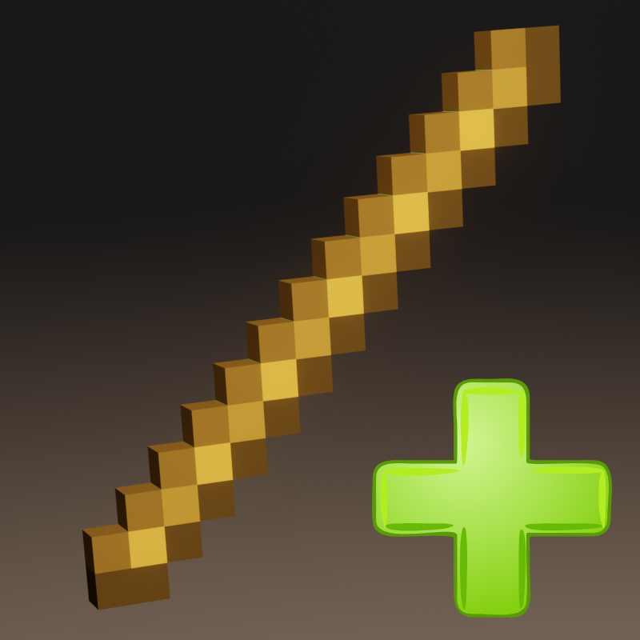

<div align="center">
  
  <h1>CustomItem (API / Configuration)</h1>
</div>

<p align="center">
 A plugin to add items hyper easily !
</p>

> **Note:** Creates issues if you find bugs :)

## Plugins
_**Your Imagination no longer imitates it. Create, invent your Mod would like to have on your server**_

* Armor 🛡️
* Sword ⚔️
* Tools ⚒️
* Food 🥔

**We offer You A Config For beginners But also, for more to free an API !!!**

 **This plugin is made for pocketmine 4 but has a pocketmine 3 version.**

## Config
To create items in The config file :
```yml
  item:
    basic:
      id: 1059 #ID Of Item
      name: "basic_config" #Name of item do not use a shift
      texture: "stick" #texture in pack
```
All the examples are in the YMl file : https://github.com/Big-Potatoes/CustomItem/blob/main/resources/config.yml

## API
To access the plugin functionality:
```PHP
use Refaltor\Natof\CustomItem\CustomItem;
```

To get started on our API, here are the basics :


Write on your congif.yml
```YML
name: YourPlugin
version: 1.0.0
api: 4.0.0
main: Your Main
softdepend:
  - CustomItem
```


```PHP
// creates an item
$item = CustomItem::createBasicItem(new ItemIdentifier(1000, 0), 'name');

// to put a texture to the item
$item->setTexture('apple');

// to save the item on the server
CustomItem::registerItem($item);
```

## Items events

> The plugin contains support with events for all items, events are used with a callable
```PHP
$item = CustomItem::createBasicItem(new ItemIdentifier(<id>, <meta>), 'name');

// all available events with the parameters

$item->setInteractOnBlockListener(Player $player, Block $blockReplace, Block $blockClicked, int $face, Vector3 $clickVector);
$item->setReleaseUsingListener(Player $player);
$item->setClickAirListener(Player $player, Vector3 $directionVector);
$item->setDestroyBlockListener(Block $block);
$item->setAttackEntityListener(Entity $victim);
```

## Support Armor
> The plugin allows to add real armor with real durability
```PHP
// to create a helmet
$item = CustomItem::createHelmetItem(new ItemIdentifier(<id>, <meta>), new ArmorTypeInfo(<defense points>, <durability>, <armor slot but it’s not important>), 'Helmet Test');
$item->setTexture('iron_helmet');
CustomItem::registerItem($item);

// all the functions of armor
$item = CustomItem::createHelmetItem(new ItemIdentifier(<id>, <meta>), new ArmorTypeInfo(<defense points>, <durability>, <armor slot but it’s not important>), 'Helmet Test');
$item = CustomItem::createChestplateItem(new ItemIdentifier(<id>, <meta>), new ArmorTypeInfo(<defense points>, <durability>, <armor slot but it’s not important>), 'Chestplate Test');
$item = CustomItem::createLeggingsItem(new ItemIdentifier(<id>, <meta>), new ArmorTypeInfo(<defense points>, <durability>, <armor slot but it’s not important>), 'Leggings Test');
$item = CustomItem::createBootsItem(new ItemIdentifier(<id>, <meta>), new ArmorTypeInfo(<defense points>, <durability>, <armor slot but it’s not important>), 'Boots Test');
```

## Support Food Item
> The plugin contains support to add food to the server.
```PHP
// to create a food item
$item = CustomItem::createFoodItem(new ItemIdentifier(<i>, <meta>), 'name', <int food restore>, <float saturation restore>);
$item->setTexture('steak');
CustomItem::registerItem($item);

// event for food items
$item->setConsumeListener(Player $player, Item $item);
```


## Demo

Futur

## TODO

* [x] Food Bugs Fix
* [x] Armor Equip Fix
* [x] Pickaxe Mining fix 1/2
